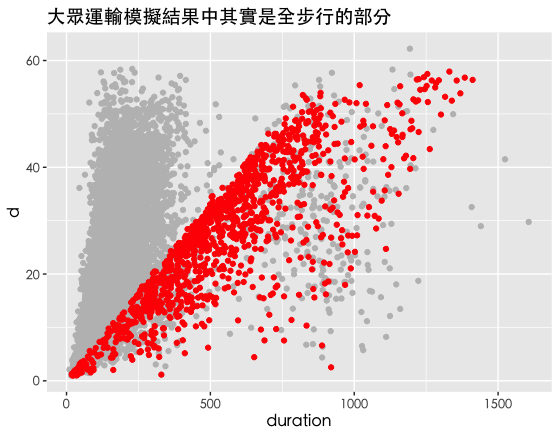

# 台南自駕與大眾運輸工具效率比較

模擬開車與大眾運輸的車輛路徑及時間，藉以比較兩者的差異。

## 資料來源
GoogleMaps API的2萬次隨機點模擬結果，分析結果儲存於rroute.RData。

item:模擬編號，type:1=自駕 2=大眾運輸，duration:交通時間（分鐘），distance:行駛距離（km），route:路徑線，d:兩點直線距離，walking:步行時間，driving:自駕行駛時間，transit:大眾運輸行駛時間

## 結果概述

坐大眾運輸系統，大約比自駕需要 5.42 倍的時間。

如果看散佈圖，會發現右邊有一塊特別花時間。

原來其實這一塊大都沒有搭公車，是用走路的。

## 註解

rroute中的route資料，是GoogleMaps導航的路徑線。可以使用以下的函式解碼成座標點：

decodeLine <- function(encoded){ #source: https://gist.github.com/Tafkas/8965616
  require(bitops)
  vlen <- nchar(encoded)
  vindex <- 0
  varray <- NULL
  vlat <- 0
  vlng <- 0
  while(vindex < vlen){
    vb <- NULL
    vshift <- 0
    vresult <- 0
    repeat{
      if(vindex + 1 <= vlen){
        vindex <- vindex + 1
        vb <- as.integer(charToRaw(substr(encoded, vindex, vindex))) - 63
      }
      vresult <- bitOr(vresult, bitShiftL(bitAnd(vb, 31), vshift))
      vshift <- vshift + 5
      if(vb < 32) break
    }
    dlat <- ifelse( bitAnd(vresult, 1) , -(bitShiftR(vresult, 1)+1) , bitShiftR(vresult, 1) )
    vlat <- vlat + dlat
    vshift <- 0
    vresult <- 0
    repeat{
      if(vindex + 1 <= vlen) {
        vindex <- vindex+1
        vb <- as.integer(charToRaw(substr(encoded, vindex, vindex))) - 63
      }
      vresult <- bitOr(vresult, bitShiftL(bitAnd(vb, 31), vshift))
      vshift <- vshift + 5
      if(vb < 32) break
    }
    dlng <- ifelse( bitAnd(vresult, 1) , -(bitShiftR(vresult, 1)+1) , bitShiftR(vresult, 1)
    )
    vlng <- vlng + dlng
    varray <- rbind(varray, c(vlat * 1e-5, vlng * 1e-5))
  }
  coords <- data.frame(varray)
  names(coords) <- c("lat", "lon")
  coords
}
